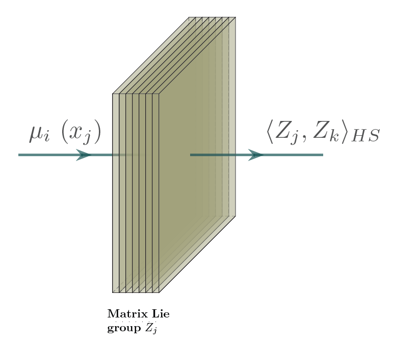
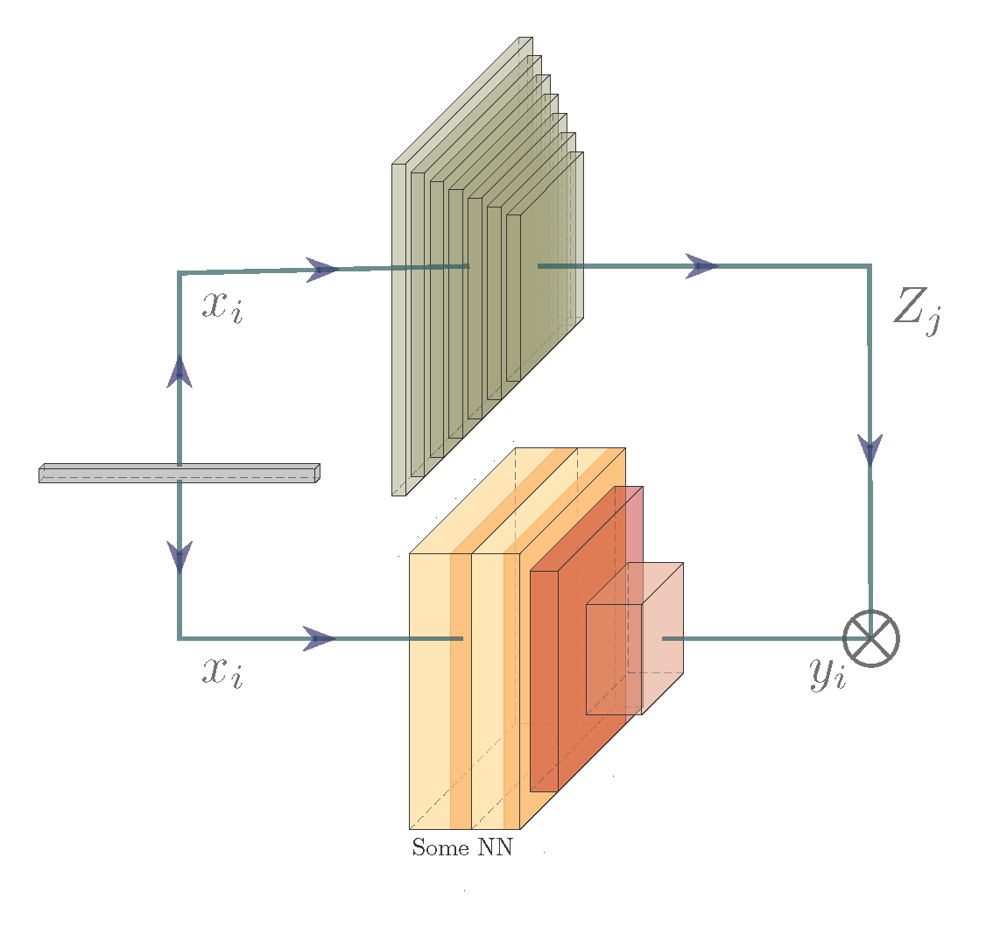

 (Forked project) Path Development Network with Finite dimensional Lie Group Representation
========================================
https://github.com/PDevNet/DevNet

<p align="center">

</p>

This repository is the official implementation  of the paper entitled "Path Development Network with Finite dimensional Lie Group"

## Environment Setup
The code has been tested successfully using Python 3.7; thus we suggest using this version or a later version of Python. A typical process for installing the package dependencies involves creating a new Python virtual environment.

To install the required packages, run the following:
```console
pip install .
```


## Expected path development

Harmonic analysis on path spaces has already been explored :
- Chevyrev, Ilya, and Terry Lyons. "Characteristic functions of measures on geometric rough paths." (2016): 4049-4082.
- Fawcett, Thomas. Problems in stochastic analysis. Connections between rough paths and non-commutative harmonic analysis. Diss. University of Oxford, 2003.
- Chevyrev, Ilya, and Harald Oberhauser. "Signature moments to characterize laws of stochastic processes." arXiv preprint arXiv:1810.10971 (2018).

The objective of this fork is to apply expected signature and expected path development and compare their computational cost and effectiveness for inference on datasets of different natures.


First using the natural data structure of the Hilbert space embedding : 
<p align="center">

</p>
It can be thought of as a nearest neighbour method.

Then, each Lie group defines an action that can be applied inside a network :
<p align="center">

</p>

visualisation with : https://github.com/HarisIqbal88/PlotNeuralNet